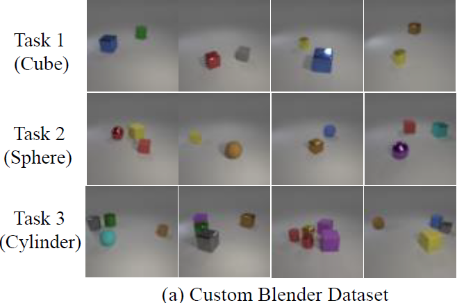
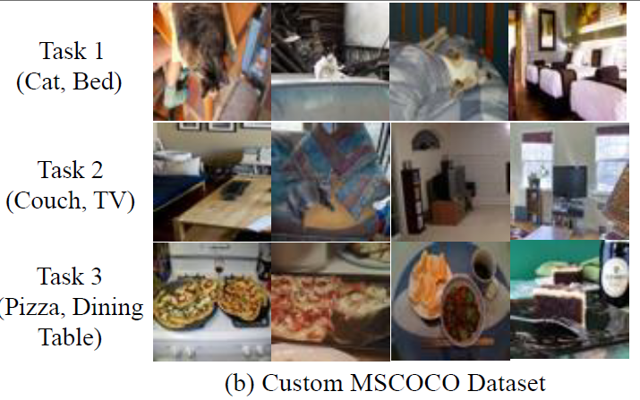
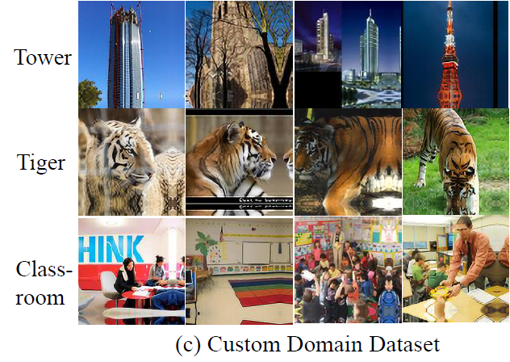

## Benchmark for Continual Generative Modeling

This is the pytorch code for Training and Evaluations proposed in  **Benchmark for Continual Generative Modeling**.


--------------------------------------------------------------------------------------------------------
* The codebase is built upon [GLIDE-Finetune](https://github.com/afiaka87/glide-finetune) and [Composable Diffusion](https://github.com/energy-based-model/Compositional-Visual-Generation-with-Composable-Diffusion-Models-PyTorch).


## Installation

Run following to create a conda environment using the requirements file, and activate it:
```
conda create --name cgm_benchmark --file requirements.txt
conda activate cgm_benchmark
```
## Datasets

### Custom-Blender 
The dataset can be downloaded from [here](https://drive.google.com/drive/folders/1dqAFG8E2IuAsu80UJJ6VvRHJaOrLmgsz?usp=sharing). 
<p align="center">
  
</p>

### Custom-MSCOCO
The dataset can be downloaded from [here](https://drive.google.com/drive/folders/11R2k1pLzGOr-2e0XU5MqGMk_2kp6D0nw?usp=sharing). 
<p align="center">
  
</p>

### Custom-Domain
The dataset can be downloaded from [here](https://drive.google.com/drive/folders/15i59dCN3MAz0HaZBL5M6UHPiFFjDDCFN?usp=sharing). 

<p align="center">
  
</p>


Now, you can provide the path of the npz file in the training script. 

## Training

To train the Score Parameterized Classifier-Free Diffusion model on C-MSCOCO dataset you can run the below command after data path and model path changes in the scripts :

```
bash scripts/train_mscoco.sh
```
Other scripts are also provided for the reference in the scripts folder.

For enabling energy parameterized diffusion model training you can use the following flag in the script :
```
--energy_mode
```
For using Denoising autoencder inspired energy function you can use the following flag, else default is L2 norm inspired energy function :
```
--is_ae
```
You can refer to this line for Energy functions used for training here [Line](https://github.com/CGM-Benchmark/CGM_Benchmark/blob/main/composable_diffusion/unet.py#L918)

## Evaluations
For evaluations we provide our evaluation data/indexes used to get the FID and accuracy reported in the paper. You can also download the checkpoints of our trained diffusion models provided [here](https://drive.google.com/drive/folders/1rsScCeNBXz8-gabt5N-OawjHmTt9vRDU?usp=sharing).

### Incremental generations

For the incremental generation evaluation, you can first download the files from the data folders provided above. 

For C-MSCOCO dataset, you can download the evaluation data which have 1000 samples for each category from [here](https://drive.google.com/drive/folders/11R2k1pLzGOr-2e0XU5MqGMk_2kp6D0nw?usp=sharing) with filename "mscoco_eval_data.tar.gz" . You can unzip this file and there are 6 npz format files, you should provide the path to this folder during evaluation for mscoco. For generating 1000 samples for class 1 you can use the following script :
```
bash scripts/sample_img_mscoco.sh
```
Similar example for blender is also provided in the scripts folder. For C-Blender dataset, you can download the evaluation data which have 2000 samples we used for each shapes/labels from [here](https://drive.google.com/drive/folders/1Uz4RHi97q4MvIPTD7ffwxqfIPcaJ6GDv?usp=sharing) with filename "C_Blender_eval_data.npz".

For C-Domain dataset, you don't need to download the dataset you can run the below script to generate 500 images for the given class: 

```
bash scripts/sample_img_domain.sh
```
### Compositional Generation

For the compositional Generations you can directly geneate samples using the class labels for respective datasets with the choice of the sampler. For generating 100 compositions of "Cube And Sphere" using "UHMC" sampler from Custom Blender Dataset, you can run the following script : 
```
bash scripts/sample_compose_blender.sh
```
You can follow the similar process for c-mscoco also.

### Accuracy And FID Calculations
For calculating the accuracy on the generated images, you first need to download the checkpoints of the classifiers provided [here](https://drive.google.com/drive/folders/1YkD2v8Chuptp8e7_VEi07uvgVc02AZWY?usp=sharing). 

Now, you can use the following script to calculate the accuracy on the generated images:

```
bash classifier/eval.sh 
```

For the FID evaluations we are using the  implementation from [here](https://github.com/openai/guided-diffusion/tree/main/evaluations) and you can use the following command :
```
# Note: We have original and sampled images both stored in npz format in our generated samples code, so we are not passing two seperate sample and reference batch

python evaluator.py --sample_batch $path_to_generated_samples_npz_file
```

### Example generation
We provided an example script to generate samples using the provided diffusion checkpoints [here](https://drive.google.com/drive/folders/1K9L0PK4GKrr_LatS7L4B7ckL-zElXoth?usp=drive_link), first you need to unzip the files and provide the path of the files in the script scripts/inf_sample.sh with suitable arguments. One example is already given in the script "inf_sample.sh" for score based model and You can use the following command to generate the samples: 
```
bash scripts/inf_sample.sh
```


## License

This project is under the Creative Commons CC BY 4.0 license. See [LICENSE](https://creativecommons.org/licenses/by/4.0/).
